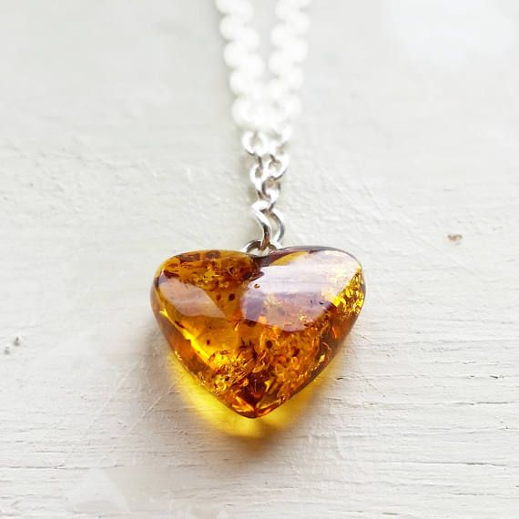



     
     
    
    Sourced from Google Images



If all you need is inside of you \
If desires, like threads of entanglement, \
Spawning from your heart \
Can be cut, and let go \
Like a forgotten coffee cup on a subway \
If feelings can be let go \
Like fragrance emanating from a flower \
Without leaving it any less fragrant \
Than before \
If memories can stay on \
Like frozen bugs in a heart of amber \
That one hides in a far away jewelry box \
One I used to wear as a pendant of love everyday \
Like a scar that I touch over with make up \
A story to tell of a once upon a time \
No longer relevant, no longer painful, no longer fresh \
A wound that healed a long time ago \
Giving way to new found freedom \
From stumbling on happiness within \
That always existed like a tiny lamp inside of you\
One that never stopped burning \
One that with a little care,
Is an ever raging flame of secure self love \
Knowing that who you wanted was always within \
Others choices are irrelevant \
If I choose me every day \
If I am enough for me in every way 