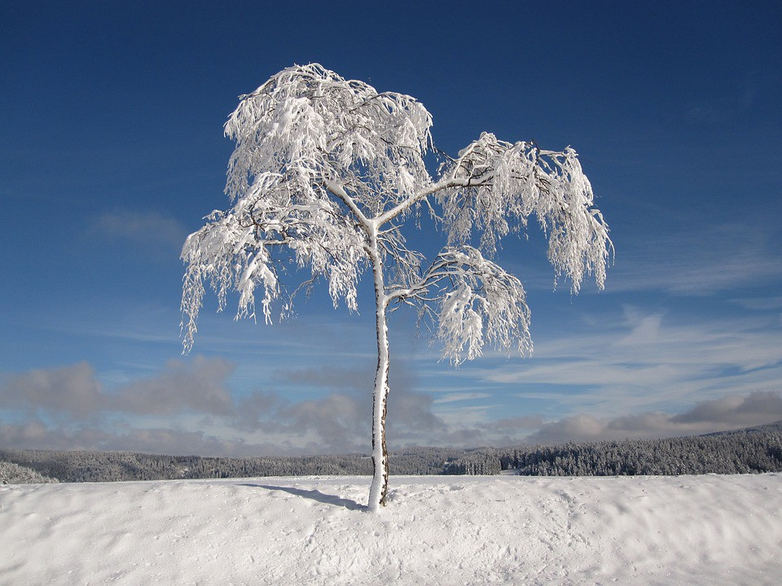

Originally posted on [Medium](https://medium.com/%E0%B4%95%E0%B5%81%E0%B4%B1%E0%B4%BF%E0%B4%AA%E0%B5%8D%E0%B4%AA%E0%B5%81%E0%B4%95%E0%B5%BE/moods-of-weather-f5e165ccaca1?source=---------7-----------------------)





Shedding leaves and pretenses  
Dropping off, pieces of one’s soul  
Carried in the wind,  
Passing on the living will  
Leaving bare bones, branches behind  
Shrinking in, staring within  
Introverted shrugging to oneself  
Quiet, unhindered  
Preparing to be hit  
By the the chill of loneliness  
A lazy winter and creeping cold  
Like cancer on your determination  
Spreading eerily, binding you  
Estranged frosty bite of a distilled purpose  
Dreams that have grown rusty  
Stuck in a glass cage of ordinariness  
Unbeknownst, that  
Strength of a will is not measured in its surge  
But in its endurance of purpose  
Finding your way when the mist is dense  
Flashy displays are for easy, emotional fools  
Takes a special someone to tie the open loops  
Making silent small strides  
Marching on  
While the world is blissfully asleep.

:)
