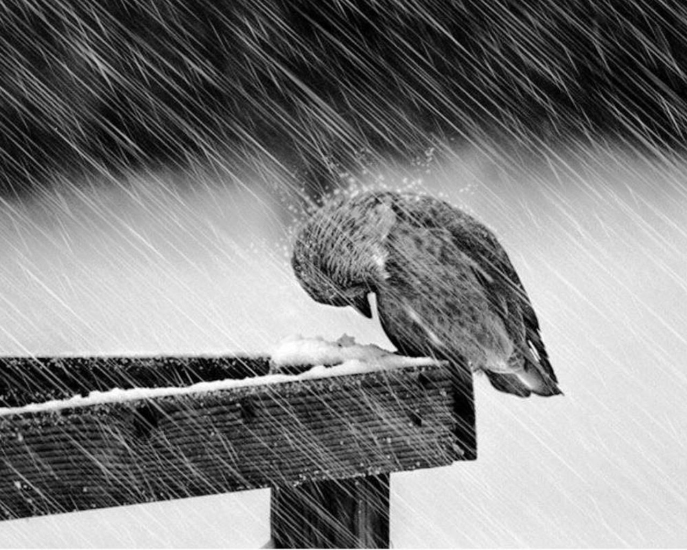

Originally posted on [Medium](https://medium.com/%E0%B4%95%E0%B5%81%E0%B4%B1%E0%B4%BF%E0%B4%AA%E0%B5%8D%E0%B4%AA%E0%B5%81%E0%B4%95%E0%B5%BE/never-had-been-2a2df596cbc4?source=---------2-----------------------)



<figure style="height: 100%; width: 45%; float: right; padding-left: 2rem;" >

<figcaption>Image source : <a href="https://cynthiamorton.com/fear-storms-2/">here</a></figcaption>
</figure>


Pacing through a glass castle of mine

That is shattered in all but a second

At once when one is hit in the face by the chilling storm outside

How can you be mine but yet never have been mine

Feeling threatened in the most primal way

I’m alone, irrevocably so, irreversibly so

Even when engulfed in your arms

Listening to your heart beats so close

I hear your words but they fall empty

For I no longer feel them

Having been fooled, oh so thoroughly

And alone I pace, alone I walk and pick up the shatters

Of what our relationship was supposed to be

No longer worthwhile, an illusion that was as real to be almost palpable, yet so truly unreal in its core

Like a dream that could’ve been but just wasn’t

Why’d you drop the nest we were building?

For the briefness of pleasure you destroyed what could’ve been, perhaps, a lifetime

And now there’s no way to go back

Hard as I try and you try

There’s no way to go back

Even if I ardently wish there was

For there is no where where I can be

With my head held high and clasp your arms at the same time

And often there’s no will for the heart is tired

Of being let down, taking apart a cobweb of lies

Discovering you in a different light

Every day

Sinking in the slow realization that who I loved never existed

Your image in my mind, once elegant,

Crumbling to a tiny ball of paper to be cast away in trash

That all I saw was a shadow I desired to see

In the shells of a frail, small, old skeleton that is unremarkably you

You never had been the man I wanted or adored or respected

You never had been the man I thought I held close

You never had been and we never had been.

One can only be hurt so much and then numbness takes over

Whoever said that the opposite of love was hate?

For the opposite of love is indifference,

Stone, cold, unyielding indifference

That is taking over my heart, freezing it into stone,

Unfeeling and cold and indifferent

And closed to you

Decidedly beyond your reach.
