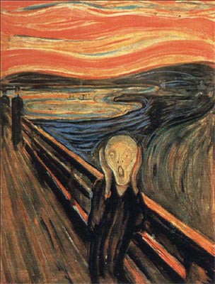

Originally posted on [Medium](https://medium.com/%E0%B4%95%E0%B5%81%E0%B4%B1%E0%B4%BF%E0%B4%AA%E0%B5%8D%E0%B4%AA%E0%B5%81%E0%B4%95%E0%B5%BE/whyd-you-prevail-cd63630ce1ad?source=---------8-----------------------)





The contours of your face  
Imprinted in my memories  
Your face, that I’ve worshiped  
Years went by  
The wheel of time and with it the pages of history piled  
But why,  
Why don’t they erase your face from my heart  
Why don’t they dirty it  
Tear your pristine portraits  
Why do you prevail  
Like the bizarre sorrow of a cold night  
Like the forgotten whisper in the whirling wind  
Like the imaginary forms in a floating cloud  
Like the footprints in the snow, departing  
Like the waves that haunt the shores of my mind, unceasing  
Like water marks on daring rocks  
Of streams that once were,  
Their gargles resounding in the flutes of time  
Like reflections in still water, undeterred by ripples  
Staring back at me,  
An unrelenting shadow of the past  
A laugh that lingered long enough to be a frozen scream  
Like a creeping fear, a touch on the shoulder  
Turning back to see it was unreal  
Like the dejavu of a lost scene,  
One that’ll never be  
Doesn’t stop me from chasing lost mirages  
That turn to nothing in your palms as you grab them
