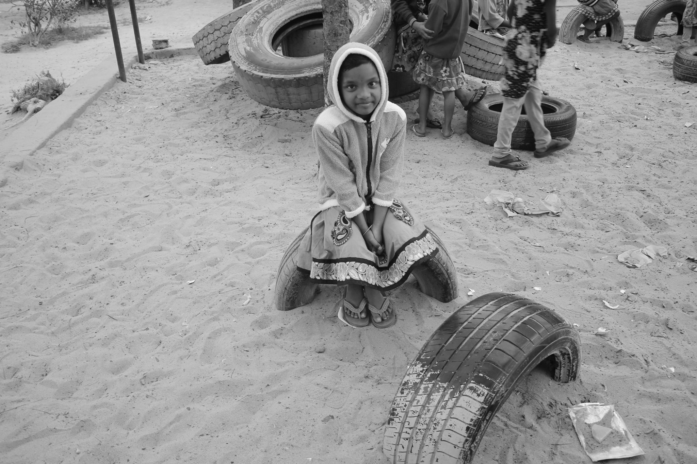
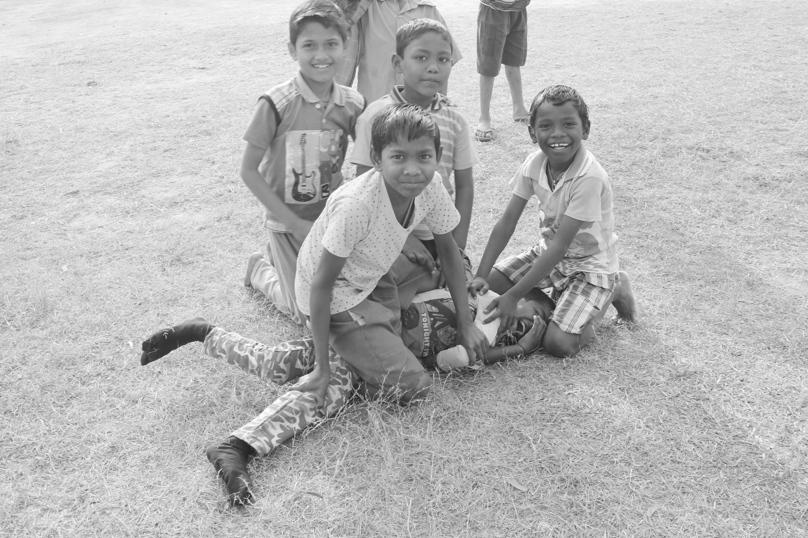
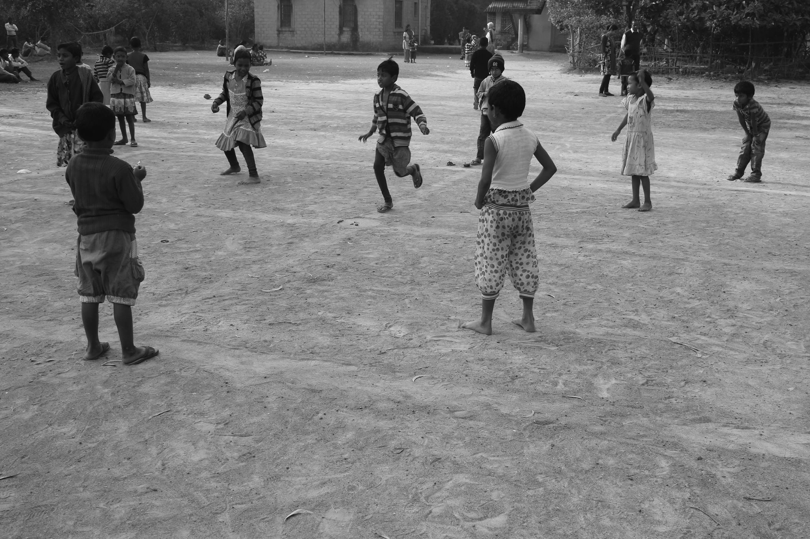
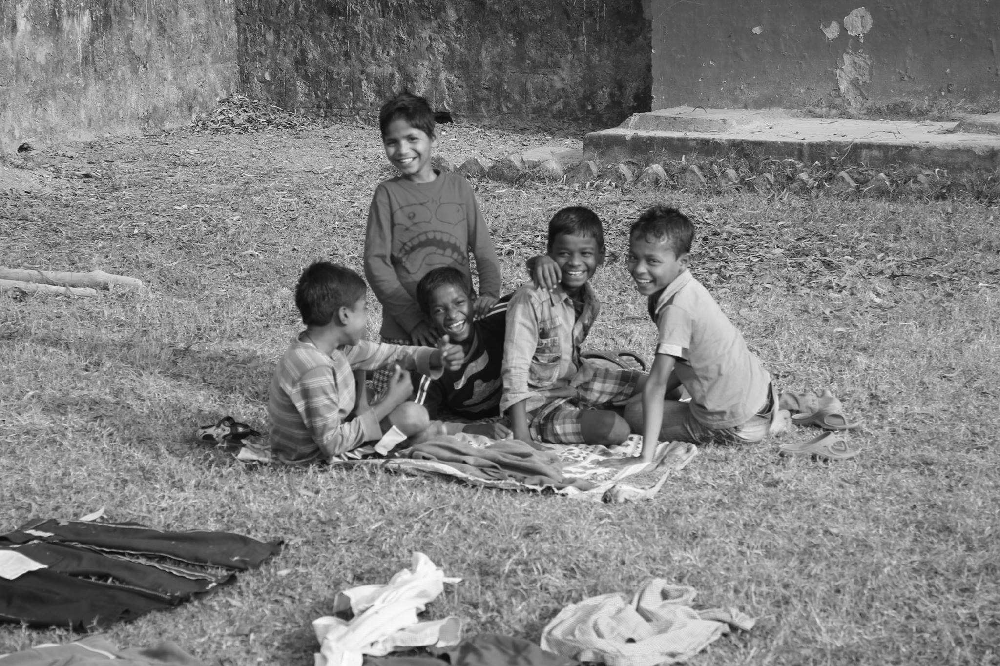
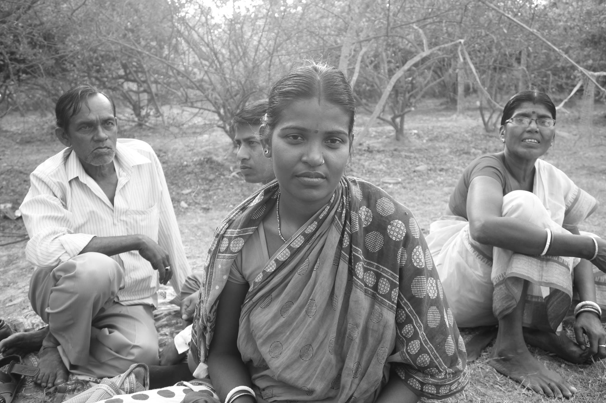
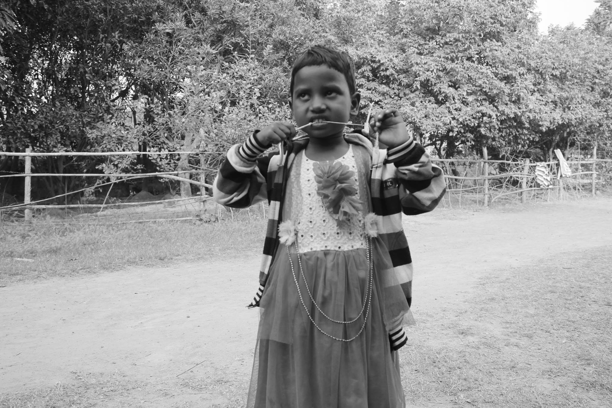


<blockquote class="twitter-tweet">
Question about literal effective altruism. Let&#39;s say you&#39;re a random person in a non-western country, and you go around visiting various rural communities where means are limited, offering direct help.  What help / intervention would be most effective for your time and money?
&mdash; Catherine Olsson (@catherineols) <a href="https://twitter.com/catherineols/status/1545464234884190210?ref_src=twsrc%5Etfw">July 8, 2022</a></blockquote> 


I spent 2 years organizing a volunteer community around and working with the [Disha Seema School](http://www.jdtdisha.org/donations) in Kharagpur. The school educates and boards ~270 kids from grades 1-12, and these kids mostly come from an underprivileged background. The school is financially supported by patrons who are mostly alumni of Indian Institute of Technology (IIT) and run by Ms Hansa Nundy, herself an IIT alumna from the 1970s. It was such a different world that it seems like another life to me now, having lived in the bay area for 3 years.

#### What I learnt from those two years:

1. *Please note that I’m speaking from experience and memory. Experience is probably not generalizable as it is only one data sample, and this post is not very statistically driven.*

2. *Price calculations were done 5 years ago, so, please account for inflation and currency fluctuations.*

* For kids &lt; 10 yrs old, enforcing **basic hygiene** interventions can keep illnesses such as dysentery / cholera / typhoid at bay and boost their attendance in school
    1. To not drink water straight out of the tap and drink chlorinated / purified water. Sometimes this is just a matter of money. For example, a water purifier at the time cost ~Rs 8000 (100$) and the school had only one installed. Since it was far from where the girls boarded, they just drank out of the tap in the evenings. 
    2. Washing hands before eating, not eating mucus/sand etc when having a runny nose
* For kids &lt; 10 yrs old, interventions to ensure** basic nutrition** is met can help proper growth and prevent poverty related malnutrition and stunting.
    1. Protein is especially expensive. Providing one egg a day or a glass of milk for 270 students cost Rs 52500 ($660) and Rs 103680 ($1300)respectively for half a year, and that expense was beyond budget at the time. If I were a mother, I cannot imagine raising a child and being unable to provide an egg a day, so my heart breaks for the fact that so many children in India have to grow up without even the bare minimum.
* **Standard EA interventions** like medicated mosquito nets to prevent malaria/dengue
* **Infrastructure for school and sports** such as uniforms, volleyballs, cricket bats, shoes etc, which are a bit of a privilege when talking in income a computers for personal use.

Here’s [a list I compiled](https://dishaseemaschool.github.io/be-their-genie/) a few years ago for that one school.

* Most of the children seemed to come from unstable families, which is culturally quite out of distribution in the Indian middle/upper class. From what I understood from talking to others, dealing with disruptive events such as your mother eloping with her lover or extreme circumstances on an everyday basis, such as a drunken and domestically violent father, the last thing on your mind is focusing on studying. It also seemed like a prevalent notion that girls falling in love and eloping takes them out of school, the brightest girl at the time in 10th grade eloped before finishing her board exams. 
* Educating girls educates a family. Maternal education, among other things is [strongly linked to](https://www.thehindu.com/sci-tech/health/education-for-mothers-directly-linked-to-better-nutrition-for-children-survey/article29674697.ece) better child nutrition
* Role models matter a lot. As a young adult tutoring little girls, they were often shy to interact with me and were constantly imitating me. Knowing how much you’re watched and adored would require you to adapt your behaviours. 

In India, education and paper credentials of education serve as gatekeepers for several “privileged” and stable jobs. This is very different from the US where dropping out of school is fashionable today. In my home state of Kerala, being a bus driver with the state transportation department required at least a high school degree.  [PhD and advanced degree](https://www.indiatoday.in/education-today/news/story/992-phd-holders-23-000-mphil-holders-appear-for-tnpsc-clerk-level-job-test-1171638-2018-02-17) holders queue up en masse for limited government clerk positions.

Coming from a third world country, this is one of the reasons EA is somewhat unrelatable to me. Most EAs and their leadership are often situated in wealthy countries and thinking from a first world perspective. My first introduction to EA was through William McAskill’s “Doing Good Better” over 7 years ago. What strikes me as “innovative” from that book and talking to the EAs in SF is the”gotcha” mindset to doing good eg. playgrounds with water pumps bad, mosquito nets good. But the gotchas have often evolved into somewhat bizarre things off late eg. paying engineers to stop building AGI. This also ignores the inherent nonlinearity in “good done” per marginal dollar. The lack of diverse representation in thought leadership from poor countries makes EA as a movement incoherent with the lived realities of the developing world. **To sit in the bay area or London and worry about long termism / X-risk / population collapse requires massive privilege, but only half way across the globe, a whole other world murmurs in a quiet slumber.**

If you’re EA from a rich country, where can you start learning about poor countries? I’d suggest starting with “Poor Economics” by Abhijeet Banerjee and Esther Duflo. “Rebooting India” by Nandan Nilekani and “Everybody Loves a Good Drought” by P Sainath are also good options. I’d also advise to stay clear of western authors writing about developing countries for western audience such as “How Asia Works”, since they tend to pick data points to confirm previously held beliefs about Asian countries. To donate to Disha Seema School, check [here](https://dishaseemaschool.github.io/be-their-genie/) and [here](http://www.jdtdisha.org/donations).


<head>
<meta name="viewport" content="width=device-width, initial-scale=1.0">

</head>
<body>

<!-- Header -->

<!-- Photo Grid -->

 
  

    
  

  

    
  
  
  

    
  

  

    
  

  

    
  

  

    
  

</body>


