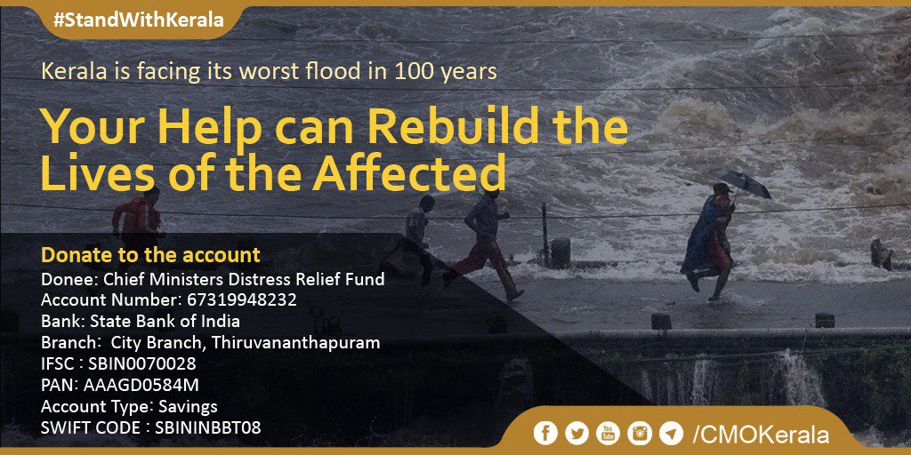
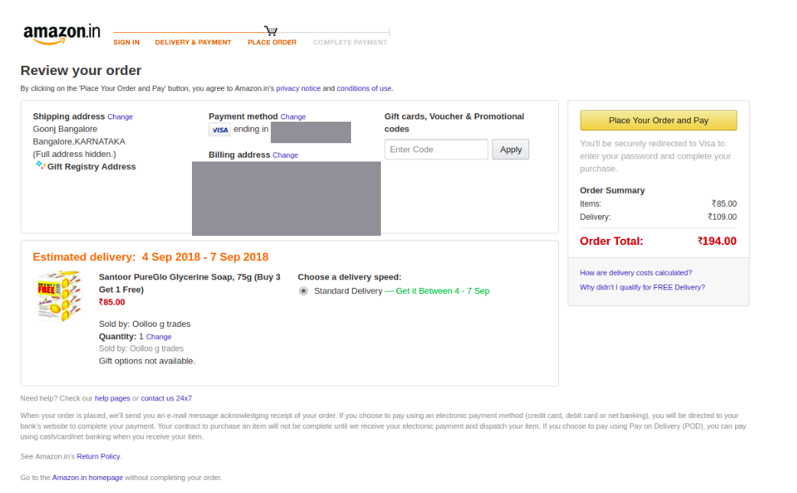

# What are optimal ways to donate for Kerala Flood Relief and Rescue if you live abroad?

Originally Written [here](https://medium.com/%E0%B4%95%E0%B5%81%E0%B4%B1%E0%B4%BF%E0%B4%AA%E0%B5%8D%E0%B4%AA%E0%B5%81%E0%B4%95%E0%B5%BE/what-are-optimal-ways-to-donate-for-kerala-flood-relief-and-rescue-if-you-live-abroad-71df5ae196c8?source=---------5-----------------------)

Here we’ve made a list of options for those based in the US/outside India to contribute to relief in Kerala floods. Each of them have been verified with a US based card. Do share more in links in comments, if you’re aware and we’ll analyse/verify/update.

**1\. The Chief Minister’s Distress Relief Fund website** has recently added the functionality to accept international cards

[https://kerala.gov.in/](https://kerala.gov.in/) : Click on ‘Donate Now’ button at top which will redirect to an SBI based pipeline.

Upsides:

- Verified with US based debit card. The bank called me on phone to verify the transaction, so do look out for that.
- It’s fastest way to send money
- Has more reach across state and directly feeds into relief and rescue efforts
- It’s official and reliable
- Tax exempted

Dowsides

- You don’t decide what exact part of the efforts your money will be used for unlike in the case of buying specific materials and sending it
- Website was down before. Use below details for bank transfer if that happens again.





Source: [https://twitter.com/CMOKerala/status/1030430627445727232](https://twitter.com/CMOKerala/status/1030430627445727232)

Note: Please verify and contribute only to trusted sources since many fake pictures and account details of individuals are doing the rounds

**2\. Google’s donation portal:**

Tiny-fied URL: [https://tinyurl.com/y9kslxfe](https://tinyurl.com/y9kslxfe)

- Verified with US based debit card
- Managed by Google as a corporation than any individual
- Money goes to center for Disaster Philantrophy which decides the most optimal use by analysing NGOs working in the affected area and then distributes
- Tax exempted in the US. Might want to check for other countries

Downsides:

- Time information on when the funds will reach is not available

**3\. Kerala Flood Relief Fund from USA** (this is the largest effort in terms of money raised I’ve seen thus far, they’ve raised nearly $800K. They take in cash via FB’s fundraising tool, and say this:

“Facebook will send money to a US checking account which we will decide whose to use after consulting with a CPA for tax savings. Then we will either wire it to Kerala Chief Minister’s Disaster Relief Fund or Personally Hand over the check on behalf of each one of you contributing to this national level effort. We will then also post proof of payment here on this page.” ):

[https://www.facebook.com/donate/237896263727840/](https://www.facebook.com/donate/237896263727840/)

Upsides:

- Payment goes through with US based debit card
- One of the largest fundraisers.

Downsides:

- Not tax exempted
- It is a personal fundraiser and not as reliable as other options.
- 2.6% of the money goes to Facebook
- It takes 30–40 days by estimation to get the money from Facebook and then to wire to CMDRF through a checking account. So it’ll only be used during the rebuilding phase, if so.

**4\. Amazon Cares:** [https://www.amazon.in/b?ie=UTF8&node=8891257031w](https://www.amazon.in/b?ie=UTF8&node=8891257031w)

Upsides:

- Can send materials and hence determine how to use your money
- Reliable

Dowsides:

- It is expensive to buy from amazon compared to state machinery buying at bulk
- Not extremely fast, delivery dates like early September
- Delivery charges sometimes costs more than the price of the item. See image below.





List will be appended. Thank you for your time and kindness.

This list was put together with the help of Mihir Kulkarni, Vivek Aithal, Sai Srivatsa
