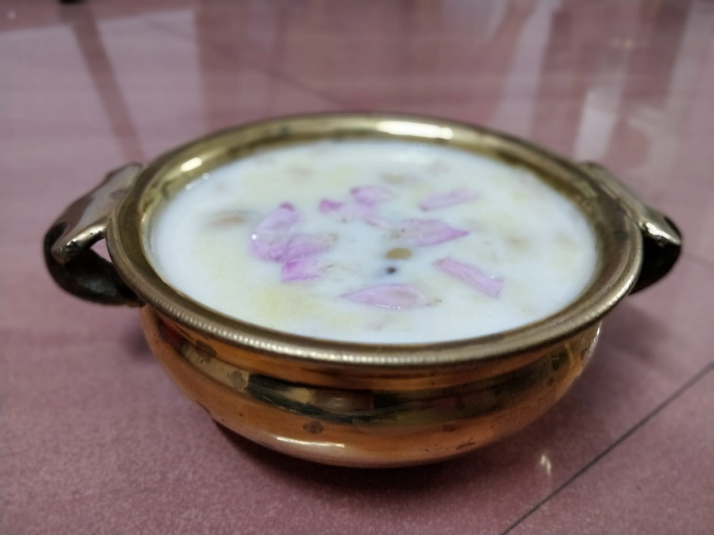

# Palpayasam





This is a traditional Malayali desert.

Expected time: 30 minutes

#### Ingredients:

1.  Milk: 750mL
2.  Water
3.  Sugar: 2 Tbsp
4.  Rice: 2.5 Tbsp
5.  Ghee: 0.75 Tbsp
6.  Cashew: 50 grams
7.  Cardamom: 1 tsp

#### Procedure:

1.  Melt the ghee and saute the rice and cashew in it for 1.5 minutes on high flame.
2.  Pour the milk, add sugar and cardamom and cook on low flame until rice is well cooked.
3.  Stir continuously.
4.  Add water to regulate the consistency.
5.  Once the rice is cooked, use your ladle to mash the rice to thicken the mixture.
6.  Take off the flame and serve hot.

#### Protip:

1.  Add a handful of rose petals a minute before you take off the flame to garnish the payasam.
