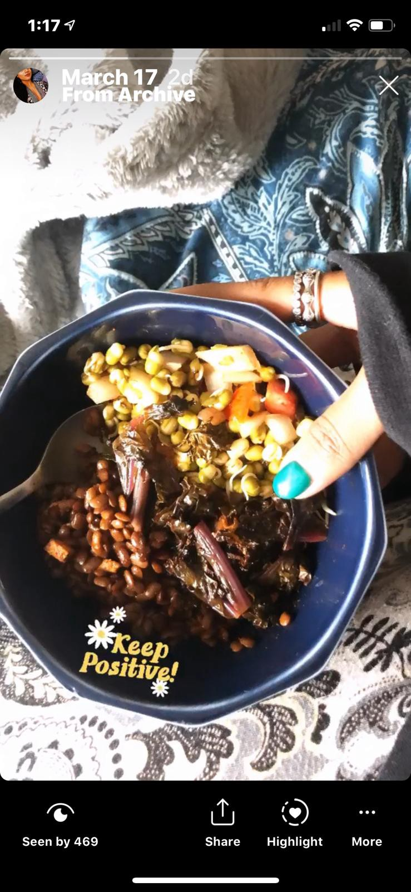
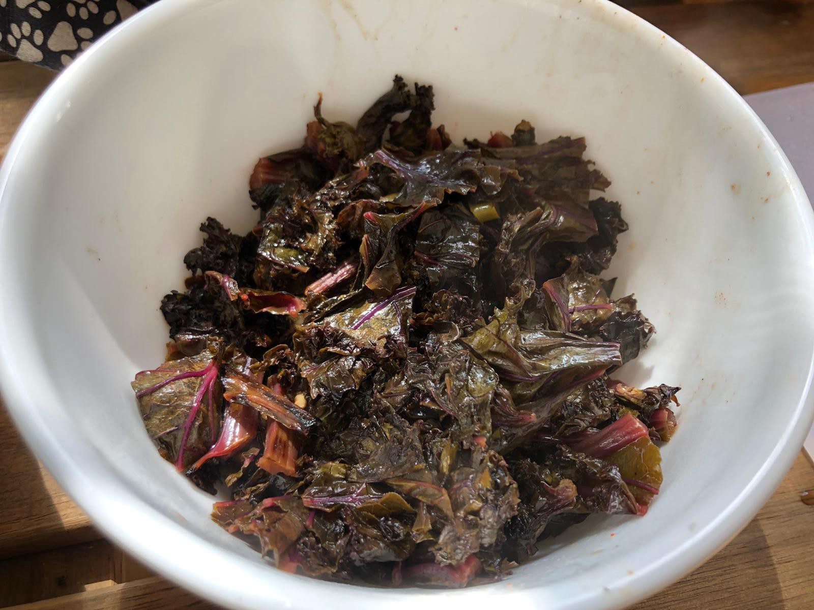
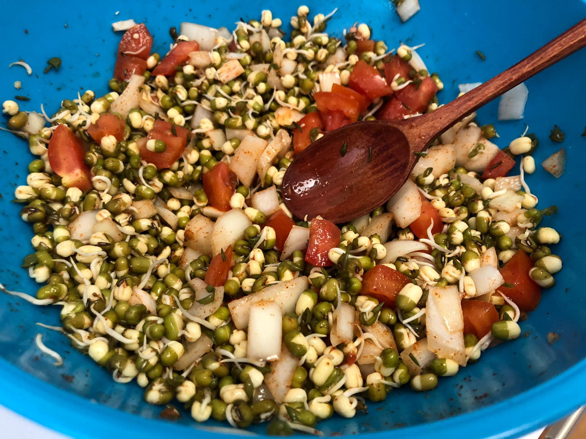

Served with a side of boiled rice.

# Horse Gram Stir Fried:

**Ingredients:**

- Horse gram — 1 cup
- Salt — 1 tbsp
- Water — 2 cups
- Green chillies — 4
- Red chilli powder — 0.5 tbsp
- Olive oil — 2 Tbsp
- Garlic — 3 cloves
- Curry leaves — optional

**Preparation:**

1.  Boil the horse gram with water and salt in a closed container / pressure cooker until cooked.
2.  Add oil in a different pan and saute the garlic, green chillies and curry leaves( if using).
3.  Drain the water from the cooked horse gram and add it to pan.
4.  Add chilli power and adjust for salt.
5.  Cook for 5 minutes and take off the stove and serve hot.

# Kale:

**Ingredients:**

- Kale — A bunch
- Salt — 0.25 tbsp
- Water — 2 Tbsp
- Red chilli powder — A pinch
- Olive oil — 2 Tbsp
- Garlic — 3 cloves
- Lemon juice — 1 tbsp

**Preparation:**

1.  Separate the kale from stem and cut into small pieces.
2.  Saute the garlic with olive oil on medium flame.
3.  Add kale, lemon juice, salt, water and red chilli powder.
4.  Mix and cook for 10 minutes covered.
5.  Serve hot.

# Sprouts Salad:

## Ingredients:

1.  Green gram sprouts — 200 grams
2.  Salt — 1 tbsp
3.  Onion — 1 small
4.  Tomato — 1
5.  Lemon juice — 1 Tbsp
6.  Red chilli powder — 0.5 tbsp
7.  Coriander leaves — to garnish

**Preparation:**

1.  Cut the onion and tomato into really small pieces.
2.  Mix all the ingredients
3.  Add chopped coriander leaves to garnish and serve!

