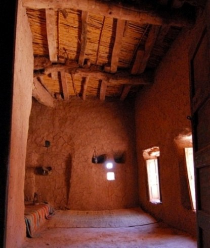
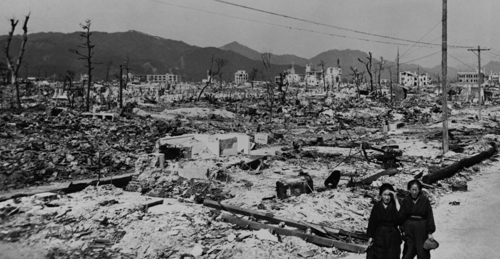
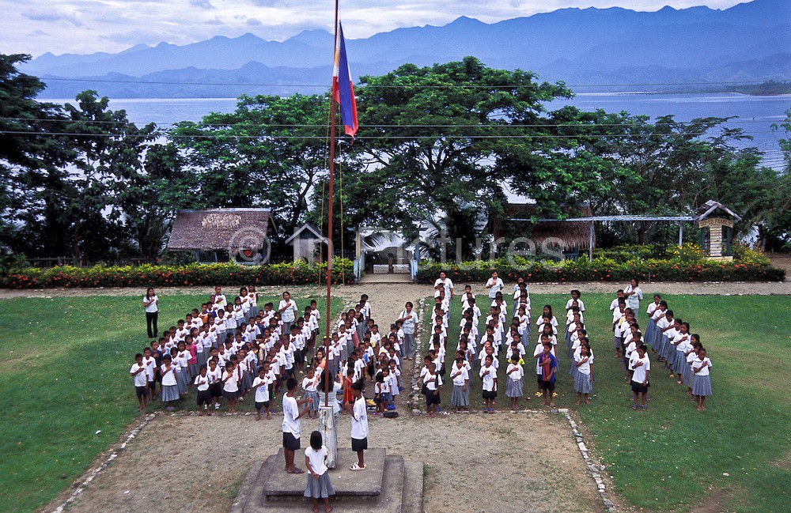

# An eventful dream

This is an account of a dream I had today:

It was set in the years of the freedom movement in India and World War 2. Agricultural production had failed due to drought, war, plunder and loot by the imperialists to aid war supplies. My grandmother and I, two patriots on the run, lived in a small and claustrophobic mud-walled shack with a tiny door and window, in the basement of a busy school building. It was stuffy and hot at noon when our door was knocked at by a visitor, a South Indian movie star, who was running from the British and seeking refuge. With a rapidly reducing stock of grain, we offered him a place, where he would sit long nights staring at the pendant he wore around his neck, a gift from his beloved before he got separated from her and was chased by the British.



<figure>

<figcaption>Image for illustration only; Source: Google Images</figcaption>
</figure>


The rebels and freedom fighters that we were, my grandmother and I set out at night to rouse a farmers’ rebellion which was quelled at the break of dawn by men in guns and boots. Many were killed and children, famished with bare ribs and bones lay by the road to die by starvation. Fleeing from the British, we reached the lawyers’ barracks, a large hall cum neighbourhood where Indian educated lawyers lived. They were amongst the last remaining houses of power that represented and sought justice for a fortunate Indian few at local courts. Unfortunately, that day, the British was carrying out a raid and tens of lawyers in their crisp white attires, their wives and belongings were lined up outside. The few children they had taken in as refugees now, ran scattered, with nowhere to go. I hid in the barracks for a while, but as the raiders were approaching, I fled as the empty and abandoned shacks were being used by drug addicts and prostitution.

Without having eaten for several days and on the run for being wanted, I blended into an elite neighbourhood where the rich lived and dined. It was amongst the few places free of police and inspection, and for a while they lost me. However, I couldn’t afford any of the meals and found it morally degrading that that part of the country lived in aplomb even as others rotted away by the side in starvation. I hung around to be informed by the waiter that a certain friend of mine had been dining there since the last two days. I wait by the golden gates of the resort to meet him. He buys me food and offers refuge and I spend the next week at his house with him and his caretaker.



<figure>

<figcaption>Image for illustration only; Source: Google Images</figcaption>
</figure>


At the end of the week, a BBC television piece(which is an error since BBC didn’t broadcast visually in the 1940s) at rudimentary TV set covers Napalm attacks nearby zooms in on victims writhing in pain by dirty drains as chemical burns subdued them. I leave his home and rush to the scene and find my grandmother and other freedom fighters there. While trying to help victims we witness marks indicating rape and torture on the bodies of several dead women. Along with 20 other people, I am recognised by the police, arrested from the scenes and sent to execution. 5 out of the 20 are shot, and I manage a quick escape while they were engaged with person lined up before me who turned out to be a highly wanted and notorious burglar.

Spared from the scene, I escape among others in a boat, even as the blood from bodies ooze into water streams and reach the shores to be reunited with my grandmother. As we flee the scene of the chemical massacre, and navigate through abandoned passages, we enter the hustling town where business goes on as usual. The flag of East India Company floats amast as children sing the National Anthem for morning assembly.



<figure>

<figcaption>Image for illustration only; Source: Google Images</figcaption>
</figure>


There, as we head to our stingy quarters we realise that there is little significance to our struggles, as one tyrannous government would be replaced by another, worshipped by many, hated by others and the ground situation wouldn’t change. We dreamt of prosperity and good food and decided to seek jobs that can pay for a comfortable living among the conflicting times.
