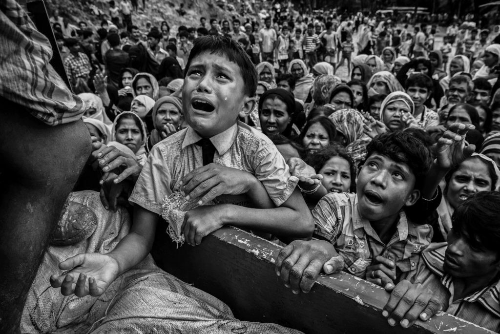

# A Song of Hatred

Originally Written [here](https://medium.com/%E0%B4%95%E0%B5%81%E0%B4%B1%E0%B4%BF%E0%B4%AA%E0%B5%8D%E0%B4%AA%E0%B5%81%E0%B4%95%E0%B5%BE/a-song-of-hatred-6c542f52179d?source=---------16-----------------------)





Photograph by Kevin Frayer [1]

The photographer Kevin Frayer explains the scene: “I arrived to Cox’s Bazar, Bangladesh, in mid-September, a few weeks into the #Rohingya crisis. I was looking for places to photograph food aid because there was such a need for it and so little of it around. I was in an area where there was a crowd of people surrounding a truck. The scene was quite chaotic; people were shouting and reaching because they were obviously distraught and hungry. There was a lot of pushing in the crowd and I wanted to get above it, so I climbed on the truck. That’s when I saw this small boy. He had just pulled himself up onto the truck and he was weeping. I couldn’t hear much because the scene was so loud, but at one point the boy reached out his hands, begging to the man standing over the food. Then, he wrapped his arms around the man’s legs, clinging to him. I was totally struck by it: he had clawed his way onto the truck in complete desperation. I wish I knew more about him, but he disappeared into the chaos of the moment.”

Us and them  
Is what Nationalism has now fallen to  
Their barbarism vs our culture  
Their savagery vs our civilisation  
Their invasion vs our tolerance  
Their Abrahamic gods vs our transcendental greatness  
Children are taught to hate  
Rohingyas, Pakistanis, Muslims, even Dalits  
Vasudhaiva Kutumbakam we say,  
But when refugees knock at doors  
We send them back to persecution  
After all, your place is your place and ours is ours  
Throw out the illegal immigrants, they say  
Mughals are villainous, they say  
Atithi devo bhava they say,  
Namaste they say,  
Acknowledge the Brahman in all, they say  
The greatest civilisation on earth  
That shuts the door on the face of the destitute  
None of us belonged here at one time!  
Agriculture was unknown 12000 years ago  
Our civilization was built by waves and waves of settlers  
Be it Aryans or Mughals or Dravidians or Adivasis  
What right do we have to say that someone doesn’t belong here  
What right do we have to send them back  
Women and children to rape and murder  
The greatest civilisation on earth  
With the blood of refugees and lynched Muslims  
Splattered on our hands, countrymen!  
Lines that were drawn by men long gone  
Jinnah and Gandhi, may they rest in peace  
Varnas resolved by sages long dead  
What a pity these lines make us hate  
These divisions make us unrelenting  
Our hearts hardened with hatred  
To the pain of real men and women  
Hindustanis and Pakistanis  
Same skin color, ethnic origins, language and food  
Alike in every way  
Yet how maginificent is the hatred we harbour  
For ones across the line!  
Our sides were chosen at random  
By the randomness of birth  
By the randomness of the sperm and egg that led to us  
And the caste/religion/place their vessels were born to  
A series of randomness that led to us  
Yet how resolutely we have chosen sides  
My religion is better than yours  
My God is better than yours  
You bow to me because I’m privileged  
Privileged by the accident of birth  
Another throw of the dice  
We’d be born a Muslim/Dalit/Refugee  
And for no fault of ours,  
We’d be at the receiving end of our very own atrocities  
We don’t choose our sides, we were born to it  
Yet how carried away in our identities we are  
How willfully we oppress the others  
Allah and Ram are one and the same, Gandhi said  
Different names for the same God, he said  
Yet in a nation that calls him Father  
We put in power those who divide  
Left as an opposite to Hindu  
Muslim as the antithesis of Hindu  
Dangling before us like carrots on a stick  
Ram Mandir vs Babri Masjid  
RAM vs HAJ  
Two alternatives, opposites, that can never coexist  
Stamping in those lines into our hearts  
Hard with designer shoes from eloquent election podiums  
Hammering in our differences  
Letting our hearts bleed with hatred  
Drawing lines, dividing us  
Yet fools that we are we pay heed to them  
Fools that we are we dance to their tunes in unaware daze  
The hatred in our hearts frozen in a trance  
Taking fiery shapes to trample the ‘others’  
All Indians are my brothers and sisters we swore  
But the asterisks and qualifiers we are now revealed  
We, and not they are true inheritors of India’s destiny  
We, and not they are the bhagyavidhaata of Bharata  
No one cares that we come from the same place!  
They have been here as long as we have been  
A country forged in diversity, unified in jingoism  
A million colors subdued by an oppressive saffron  
The tiranga traded in for the bhagwa  
Tamil and Kashmiri crushed by a colloquial Hindi  
A simmering delicacy of beef, dosa and chicken tikka  
Tossed aside for a politically correct Khichdi  
Today we live in Godse’s India, not Gandhi’s India  
Today our people’s representatives bow down to Savarkar  
The same Savarkar that swore to serve the crown of Britain  
And crush the struggle for Indian sovereignty  
Today they are king who orchestrate riots and fake encounters  
Religion that makes it acceptable to trample a full womb  
Pull out and char an unborn foetus by the cord of life,  
Its ashes washed away in a drain, the lost foetus  
Blood on our arms and our heads hung in shame  
In our India, foetuses too are branded with religion  
Religion that makes it acceptable to pelt stones at benign children  
How depraved are we as a civilisation  
How fallen are we as a culture  
Causes so big that we never hesistate to harm children!  
Today they are king who hoodwink an imperfect judiciary  
Like a puppet master that pulls at strings  
Through loop holes and dead/hostile witnesses  
Today they are king who disowned our constitution  
Dropping adjectives stealthily  
The windows of transparency  
That we celebrated as a forthcoming of democracy  
Too were given an obstinate coat of saffron paint  
In a world of PR campaigns and alternative facts  
When will truth prevail?  
Satyam kadaa vijayate?  
Is there more to India than Hindi, Hindu and Hindutva?  
When will the day come when Bharat mata be restored to her glory  
When she realises as a tolerant, forgiving mother  
That protects one and all in her bosom  
That treats each child the same  
A place for those who seek peace  
When do we grow above the pettiness  
And truly become one family!  
Truly become Vasudhaive Kutumbakam!

[1]: https://www.politico.eu/interactive/myanmar-muslims-rohingya-in-pictures-faces-of-desperation/
