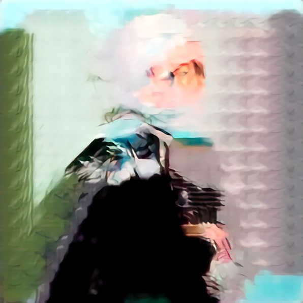

# **My Faceless Portrait**





I have  
I have a faceless portrait  
One I’ve been holding close  
For far too long  
Etched over years, touched over every now and then  
With each new dawn  
The lines grow clearer  
A faceless portrait hanging on a pedestal  
Across my hallway  
Waiting to come alive.  
Beaming with pride and  
Embellishing the sides  
I only need a face to completion.

So I set out to find one  
Walking through the crowds,  
Glancing at passersby  
Wondering if their boundaries would dissolve into my mellow sketch  
What a special face it may take to fit  
What would it be like?  
Quizzical? Laughing?  
One that belies a thousand secrets  
Yet lights up an entire sky  
Eyes that betray the depths of an ocean  
Scars that speak of wars timeless  
Or thready wrinkles that spill exhaustion

I did find faces in the crowd  
Some eager to try  
Some reluctant to fit  
Some total mismatches  
Some tried to shatter my portrait

Bitterness had made me hard  
To accept what is natural  
As I force my template  
Not wanting your appendages, your extras  
Not wanting to figure out what that is you  
Impatient, I rather clip your edges and weed your branches  
Wipe your slate clean and plant my seeds

It is too much to ask I know  
But I spent a lifetime painting  
And I will happily spend another waiting  
Adoring my faceless portrait on the wall  
One that may never be done  
Perfect even if partial  
Than take you as you are.
