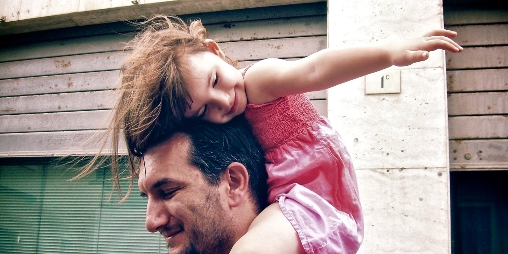

# Old and Young





Hopping over puddles, in a little pink frock  
Hardly as tall as your knee cap,  
Grasping tightly your index, with an entire little pink palm  
Running to catch up with you,  
Even as you lift and place me  
Across small pools of water on the road

Over time your pace slowed and mine picked up  
That you slowly heave to match my pace  
Making me wonder when I outstripped you..  
Have you grown old, or have you always been that slow?

Your shoulders were the highest places on earth  
Whether to watch fireworks at the temple fair  
Or looked egotistically down at siblings on my mother’s shoulders  
From my high up perch, higher than everyone  
Although, you don’t seem so towering today..  
May be because I grew up!

I could never cease to be captivated  
At your many animatic retellings of the fox and the sour grapes  
As you enacted the fox, smacking hungrily at the grapes  
And I watched still with suspense  
Wearing nothing but a little chaddi on Sunday mornings  
and letting slip bursts of giggles and wild applause at the end  
Prevailing over the twitch of steamy dosa batter  
As Amma spread them on hot pans in the kitchen

Your sneeze could shake me with shock  
Jolting my heart inside my very chest  
Your palms and feet were large as a scary predator  
But of late, wrinkles have lined up your forehead  
Your smile has grown tired, your face scaled  
Your slouch paining and arms have grown saggy  
Each time I visit, do you grow a little older?

Your hair line has retreated, and your belly grown pronounced  
A few more gray hairs have propped up on your scalp  
Couple more lines on your face  
Looking back, you are not the man of my childhood  
With a stiff bare back and haughty pace  
Running up and down the stairs youthfully  
and throwing imaginary cricket balls in the air, pacing  
Your temper softened, your voice mellowed  
Reading your newspapers with spectacles now  
Slouched like a caged, retired lion  
And a youth gone by..  
Looking back, you are not the man of my childhood  
Even though your eyes are menacingly curious as ever  
You’ve grown old..  
and I’ve taken your place!

Inherited your love for pepper and books,  
Your haughty pride in our ancestory  
And stories of the British honouring your great-grandfather  
And estranged relatives that set sail to Ceylon!  
I have taken on, your love for Carnatic and Nehru  
Tales of landlords and cesses  
And playing by the Bharathapuzha  
Broken sculptures piled in an old Kalari  
Where no one lights a lamp now  
Up for sale are old roots

Barren, broken and changed,  
From Ottapalam to California,  
What a long way we have come  
Seeds of our DNA, and creative destruction of the old  
Soon my skin will wither away  
My muscles will atrophy..  
To give way to the future, somewhere we’ll have a mark  
A tiny remembrance  
A testimony to a full, colorful life lived.
