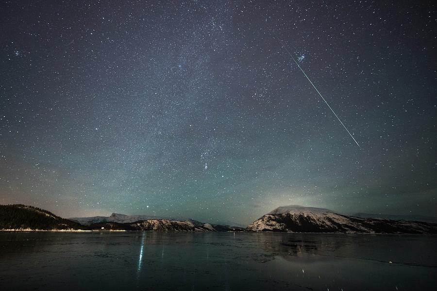

# Shooting stars





If the moment is beautiful, is consistency necessary  
If the eyes align, why do the stars need to  
If happiness can precipitate in the now, who cares if the past and future are unmade  
If the timeline is a mist, so what, if today is stark clear in a happy, mad hue  
Can we count our sins after today, losing,  
Can we contradict our values, shackles of morals, just for once  
Today, sinning in passion  
Can consistency have cracks, like little black holes, pulling us toward them, invisible yet  
Can we unravel today, unrelenting, entwined  
If our smiles can move the world  
Do they need to abide by rules  
If my fingers meld into the spaces between yours  
If now is perfect in every respect, can we escape from the world  
Together, dilating time,  
If the world stopped spinning for a second with its endless threads  
Can we noose our horses with them, tools to run away  
In a devil may care  
Escaping into a vacuum of insanity and delirium, yet very sane  
Sucked into a hollow wormhole, doorway to another universe  
Where it’s just us, no rules, no light  
Hiding in plain sight yet invisible to all  
No questions asked  
Can I swim in the world within your eyes  
Disappearing for a second, cast aside, as I glance into the naughtiness that is you  
Counting the reflection of stars in your eyes, lying on a moonlit beach  
With sand in our ears  
Embracing the orthogonal asymmetry of the noise of the waves, relentless,  
As they bash by my evolutionarily flawed pinna  
Lying awake and close to you as everybody snores  
Can we leave the world behind  
Escaping into fourth dimension  
Just you and me and the sweatiness of our palms, grinding the sand from beaches virgin,  
Even if you’re only a shell, can I wait till tomorrow to pick you apart?  
Can I wait till tomorrow to concede that you’re only perfect in my illusion?  
Can I forget, just for today, that you’re not mine to hold?  
Waltzing in the darkness, guided by our heated breaths  
In an engulfing dance, quite a trance, spellbound as if it was meant to happen since forever  
If forever was charted already why did we have to jump out of time  
Why, in the midst, where the line between imagination and reality blurs  
Did we make our world, consuming in each other  
Can we iron it, to fit reality and normalcy  
Like a globe stuck up into a map to fit in a book like all others  
That people can turn over in careless, unsuspecting boredom  
Like a riddle in plain sight, yet not one for except the lost and blind  
Can we lose ourselves in the unreal  
Forever gone, sucking in the intoxicating fumes of laughter  
Before our hands drift away and we wake up unenchanted  
Hold me by your little finger  
Like I’ve a sensation of your touch from another world as I live shackled by the strings of morality  
Meeting every expectation  
Stretching, writhing to fit the cot  
No questions asked, like a sign of the insane, free and untamed  
Will you be by me  
Like a madness that strangles to trigger off a shower of shooting stars  
In the pale cold night we lie beneath  
pleasurable, beautiful, evanescent, lasting only for a second in the now  
Much like us.
