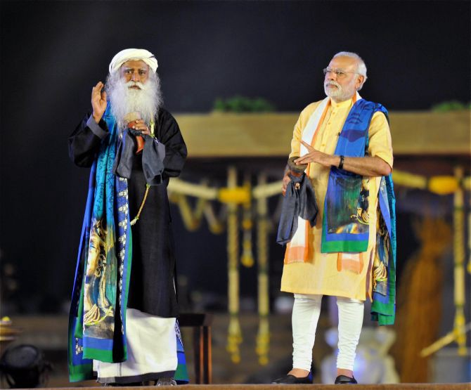

# Much Ado about Nothing

_A closer inspection of the ‘Rally for Rivers’ fanfare_

Recently, Dr Rajendra Singh, who has spend decades working on community involvement in water management, winner of the Magsaysay Award and the Stockholm Water Prize, nicknamed the ‘Waterman of India’ called out the ‘Rally for Rivers’ movement. To quote, ‘this ‘Rally for Rivers’, is not for rivers. It is for the land, for money, for power, for fame and for name’ [1]

Somebody had to say this! After seeing several friends jump on the bandwagon, with custom made Facebook DPs, I decided to check what the fuss was about. An inspection of their website shows that they’ve little to no work at the grassroots, in mobilising local communities. I’ve always wondered how those missed calls ever helped rejuvenate rivers, how a movement without a manifesto or a point plan to revive Indian rivers can qualify to be called ‘Rally for Rivers’. Compared against the fanfare, their substance is minimal. Their only major solution is to have a slice of afforested land on either side of all rivers [2], which is in many cases infeasible eg, the Ghats of Varanasi. Here’s an ecological fact check of the plan by researchers from NCBS who conclude that the proposed solution has no basis in science, but is more of a random proposition [3].

They also support inter-linking of rivers, which seems like a disastrous idea and the biggest encroachment on nature with no clear benefits, akin to demonetization. The rivers in many parts of India are widely different, their salinity, pH, silt and sand content and nature of vegetation and aquatic life. To mix the waters could be disastrous for lifeforms downstream.

Many slogans came up, emotionally compelling ones like ‘_Everyone who uses water in India should support Rally for Rivers_’, but to what end on what basis? No science or evidence-based solutions came up. Large parties and demonstrations were held where political biggies came to speak. My question is this: has a single bill been passed or introduced or drafted to help rivers?



    
    Powerful friends: Inaugurating statues <a href="http://postcard.news/lovely-gesture-prime-minister-modi-just-mindblowing/">4</a>



Lots of pseudo-scientific BS was churned out in this process, apparently justified as ancient Indian wisdom. For example, Sadhguru claims that the left hand is feminine( to be kept gentle, of course) and right hand is masculine [5], in a justification embedded with crude statements like “providing for yourself and people around you is essentially a masculine process”(not true in a lot of species where mothers provide). He spoke at IITM, one of our temples of science, where he claimed that water has memory [6]. He stated that “if knowledge comes from the east it is superstition if it comes from the west it is science”, he forgets that a fundamental qualification for something to be called science is that it is based in rationality, derived from the fundamental laws of nature and results are repeatable.

After 30 crore missed calls, hundreds of rallies, celebrity endorsements, an enormous amount of mind and media space, after talks at Philly and New York, just one question, what have you achieved? There is hardly any discussion on how to solve the problem. Amidst all of this, they’re embroiled in allegations of encroachment on wetlands [7].

Sadhguru and we can learn a thing or two about rejuvenating rivers from Medha Patkar’s Narmada Bachao Andolan or Rajendra Singh’s work in Alwar, Rajasthan. No project for saving rivers can be effective without the participation of the local communities. Another example, is the Haritha Keralam project of the Pinarayi Government in Kerala [8], which has rejuvenated 10,000 ponds, 3200 km stretch of streams and 1,500 km stretch of canals by waste management, water conservation, manual cleaning of water bodies and optimising agricultural practices. Missed calls doesn’t even scratch the surface.

Last, but not the least: appearances can be deceptive. Don’t be taken for a ride by someone whose biggest credibility derives from his looks, a babaji who seemed to have walked out of a Vedic textbook speaking about ancient Indian wisdom. Always question and fact check!

[1]: https://www.thenewsminute.com/article/wont-support-rally-rivers-indias-waterman-rajendra-singh-ishas-campaign-73353
[2]: https://cdn.isha.ws/public/docs/pdir/RFR_RevitalizationOfRiversInIndia-Web.pdf
[3]: http://www.thehindu.com/sci-tech/energy-and-environment/do-trees-make-rivers-flow/article19853181.ece
[4]: http://postcard.news/lovely-gesture-prime-minister-modi-just-mindblowing/

[5]: http://www.ishafoundation.org/us/blog/left-handed/].

[6]: https://www.youtube.com/watch?v=6C1p4HUHlfE
[7]: http://www.thehindu.com/news/national/tamil-nadu/hc-green-tribunal-issue-notice-to-isha-foundation/article17322101.ece
[8]: https://timesofindia.indiatimes.com/city/thiruvananthapuram/haritha-keralam-on-course-to-achieve-set-goals-cm/articleshow/61976314.cms
