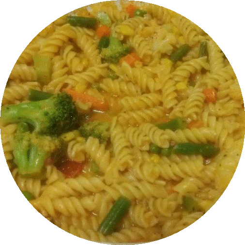

# Graduate Student Recipes: Quick and Easy Pasta





Sharing successful tidbits from my reluctant adventures as a student cook. :)

Ingredients:

1. Pasta — 1 cup
2. Salsa sauce — 3 table spoons
3. Cut up veggies — 3/5 cup
4. Soy sauce — 1 tsp
5. Garlic powder/paste — 1/2 tsp
6. Ginger powder/paste — 1/4 tsp
7. Chilli powder — 3/4 tsp
8. Parmesan Cheese grated — 1/4 cup
9. Mayonnaise — 1.5 tsp
10. Pepper grated — 1 tsp
11. Butter/ghee — 1 tsp
12. Vegetable oil — 1 tsp
13. Tomato sauce — 1 table spoon
14. Salt — 1 tsp
15. Turmeric powder — a pinch

Steps:

1. Boil the pasta for about 5 minutes until semi cooked
2. Boil veggies until semi cooked
3. Melt butter/ghee and oil in a pan on medium flame
4. Add pasta after draining water
5. Add the other ingredients and wait until pasta/veggies are fully cooked
6. Add water to regulate soupiness
7. Remove from flame, serve hot

Tips and tricks:

1. Spices vary in strength depending on brand/source, so take the values with a grain of salt, even literally :P
2. If you prefer veggies to be semi cooked instead, then skip step 2. If you’re a graduate student who wanna save time, buy frozen veggies off the shelf.
3. I added butter, ghee and mayo to increase calorie content, may regulate based on dietary preferences
4. Mayo makes the pasta a bit creamy, if you dont like it, avoid
