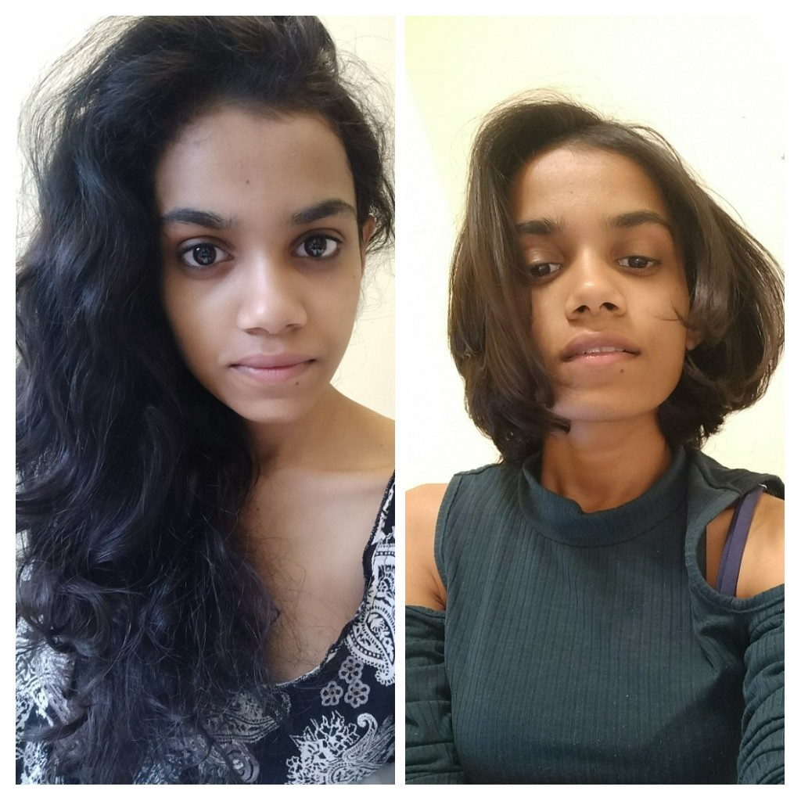

Originally Written [here](https://medium.com/%E0%B4%95%E0%B5%81%E0%B4%B1%E0%B4%BF%E0%B4%AA%E0%B5%8D%E0%B4%AA%E0%B5%81%E0%B4%95%E0%B5%BE/what-to-know-before-donating-your-hair-2cd0af4662c8?source=---------1-----------------------)

This summer, I donated ten inches of my hair to Pantene Beautiful Lengths that make wigs for people suffering from cancer. In the US alone, every year about 100,000 people take chemotherapy for cancer treatment and undergo hair loss. The process of donating is fairly simple and easy though it’s important to keep a thing or two in mind.



    
    Before - After



What to note:

1.  Talk to others before you do it and be very sure you want to donate.
2.  Choose the organisation carefully. I evaluated [**Pantene Beautiful Lengths**](https://pantene.com/en-us/experience-main-section2/beautiful-lengths), [**Locks of Love**](http://www.locksoflove.org/) and [**Wigs For Kids**](https://www.wigsforkids.org/). Among other considerations are whether they sell the wigs or donate the wigs, what causes/diseases they provide wigs for, whether they donate to kids or not. I decided to go with Pantene Beautiful Lengths.
3.  You need to have at least 8 inches of hair in order to make a contribution; this is consistent across various institutions. Since my hair is naturally curly, it took me about 1.5 years to grow the length, it is much easier with straighter hair.
4.  Bleached hair is often not accepted, though colored without bleach is often okay.
5.  Don't, of course, forget to wash it well before drying and cutting.
6.  Since donating hair is very common today, most salons are familiar with the process and receive many customers who donate hair, so you don’t have to take the trouble at home.
7.  When packing your hair it should be extremely dry as mould can grow on wet hair and make your effort go to waste.
8.  Be prepared. In many cultures, long hair is an integral component of womanhood and parting with it comes with many questions.
9.  It made me sad for days to lose my locks by choice so that makes me think how much harder it is for one to have no choice in losing all of one’s hair!
10. Go for it and have fun donating! :)
