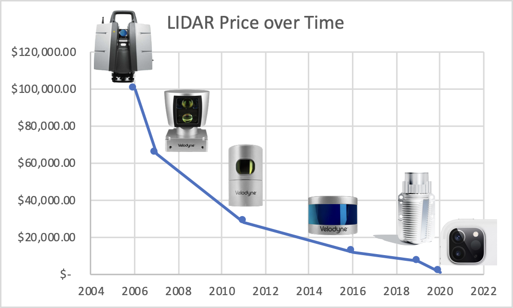

_Opinions presented in this article are that of the author alone and does not represent those of her employer._

As the new year drives in, let’s look back at some of the technological bets in self driving and where we are at with them today. Just last week [Waymo](https://blog.waymo.com/2022/12/wheels-up-for-waymo-as-we-expand.html) and [Cruise](https://twitter.com/kvogt/status/1605234916043939840) announced they are scaling to 3+ cities in the US, fully driverless. Waymo in Phoenix and SF, and Cruise in Phoenix, SF and Austin. Rides are now available to the public for charge and I myself [took a driverless ride in a Cruise](https://twitter.com/keerthanpg/status/1591355457616379905) despite not working for the company.

>>>>>  gd2md-html alert: inline image link here (to images/image1.gif). Store image on your image server and adjust path/filename/extension if necessary.  (<a href="#">Back to top</a>)(<a href="#gdcalert2">Next alert</a>) >>>>> 



       
    <a href="https://in.pinterest.com/pin/428827195751087037/">Source</a>



### Building L5 autonomy vs improving driver assistance

This rapid expansion is a point in favor of betting to build L5 autonomy directly rather than continuously improving an L3 system. Comma and Tesla who have taken the latter approach, are nowhere near close to removing the driver today and tend to look more like driver assistance systems than “full self driving”, at least as of today.

### Lidar vs vision only

It is too soon to conclude if lidar is absolutely required for l5 autonomy or if vision only approaches can still get there. A major consideration for not using lidar was cost of the device and viability of large scale data farming. Having a vision only stack allows one to keep the cost of the car cheap, as well as sell it to a wider base of customers and use that data to train self driving systems. Compared to the last decade when these bets were placed, lidar costs have fallen faster than anyone anticipated, so much that even the latest iphones 13 and 14 have one, allowing for sleek 3d imaging and low light photography. Compared to an iphone, a self driving car operates in a domain of higher velocities and very low lighting and requires a high bar of safety on account of transporting humans. In retrospect lidar may have been the right bet and this may be the bitter lesson of self driving. 



       
    <a href="https://www.avvir.io/blog-posts/the-ipad-pro-an-inflection-point-for-reality-capture">Source</a>



### Robotaxis vs personal cars business models

While the tech starting to scale, the business of making money with robotaxis is still an open question. The unit economics of HD maps + sensor suite is yet to be worked out even as price of sensors and R&D costs goes down as economics of scale starts to manifest. If a cruise car takes [$300k](https://www.businessinsider.com/google-self-driving-car-sensor-cost-2012-9) to build today, it has to execute a lot of taxi rides to end up cash flow positive. But robotaxi companies have a much higher profit potential than traditional taxi companies like Uber/Lyft. The costliest part of a traditional taxi is the human driver. For every dollar paid for an Uber ride, [75 cents goes to the driver](https://www.stilt.com/blog/2020/02/how-much-does-uber-pay/). Despite this cut, the average driver barely makes above the minimum wage. 

Compared to robotaxis that are still figuring out their business model, comma and tesla are already profitable / cash flow positive with comma 3 going at [$2k](https://comma.ai/shop) and tesla “full” self-driving at [15000$](https://electrek.co/2022/12/29/tesla-people-bought-full-self-driving-north-america/) for partial autonomy. 

### Remote teleop vs driver at wheel

Deploying robotics in the wild is possible today only with tactical human intervention. While machine learning handles more than 99% of cases, at 10 hz inference that is a mistake every 10 seconds. For Tesla/Comma, intervention is provided by the human at the wheel, for Cruise/Waymo it is teleoperated. 

Remote teleoperated fleets pair well with a service business such as robotaxis. For personal cars, it’s hard to serve remote interventions because unlike robotaxis, personal cars cannot geofence their area of operation and ensure low latency network connectivity with a remote human at all times. Due to this, personal car business models of self driving trends towards driver assistance systems because the domain of operation of a personal car is far wider to fully solve for autonomously. 

The wider operational domain of personal cars have some advantages. For example, a comma / tesla could get you a minimum intervention road trip between say San Francisco to San Diego, while Cruise/Waymo may be better for rides within the city.

### Capital and consolidation

2020 showed a consolidation in the industry with smaller players being bought out by bigger ones in lieu of the pandemic induced funding crunch, and the realization that self driving is way more capital intensive to build than anyone expected. Since the pandemic, Cruise bought Voyage, Lyft sold Level 5 to Toyota, Aurora bought Uber ATG, Amazon bought Zoox, Apple bought Drive AI, Daimler bought Torc robotics. Despite this consolidation, the bear market of 2022 and the anticipated recession continues to pose a threat to this industry. Only recently Argo AI folded back into parent Ford’s L3 driver assistance development even as onlookers thought they were too big to fail. 

### Changing landscape

Two sister industries of self driving are mapping and labeling. Due to the large scale consolidation since the pandemic, both of these industries also underwent some consolidation since buyers congregated.

Compared to mapping, labeling has a wider customer base due to its appeal to the larger ML industry. The advent of weekly supervised learning for scaled ML starting with CLIP/ GPTs has dealt a blow to traditional labeling companies like Scale AI. Most big ML companies have started their own labeling efforts and additionally [cloud providers](https://cloud.google.com/ai-platform/data-labeling/docs) now offer labeling as a service.

The speed and precision of HD maps required to drive L5 systems is another concern towards the scalability of fully driverless systems. Despite years of testing, Waymo’s footprint in [Phoenix](https://blog.waymo.com/2022/12/wheels-up-for-waymo-as-we-expand.html) continues to be small. However, recent scaling annoucements indicate that it may be possible to go from 0-100 in a new city in O(1-2 years). A slower speed of scaling may be fine for the time being: until recently Uber made a [quarter of its revenue](https://slate.com/business/2019/04/uber-ipo-nyc-london-risks.html) from just 5 cities, which is business to the order of tens of billions of dollars.

In conclusion, the last few years have given a lot of evidence for what works and what doesn’t work in self driving, both from a technology and from a business perspective. Riding in a driverless car in the winter of 2022 in SF was a magical experience, like I was sitting in the future. I am looking forward to developments in the upcoming year! :) 

